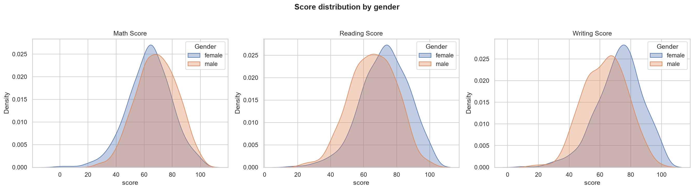
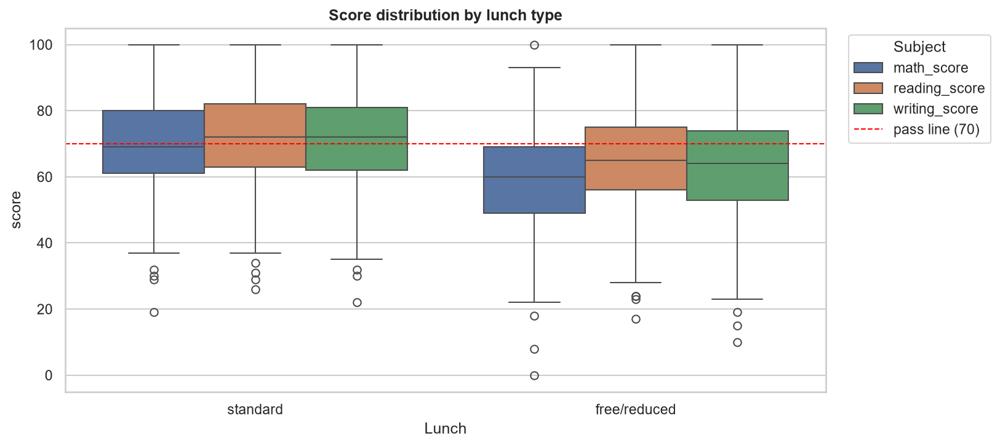
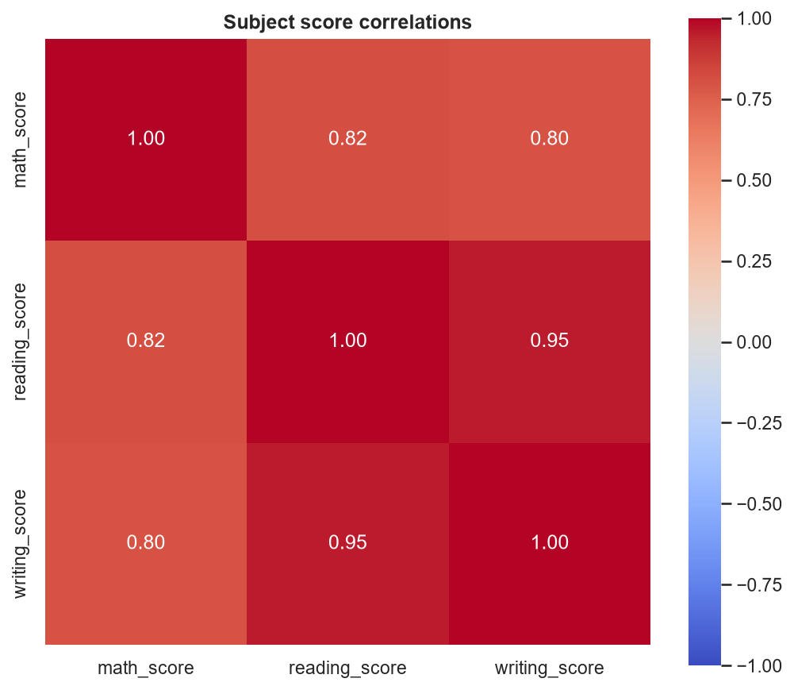
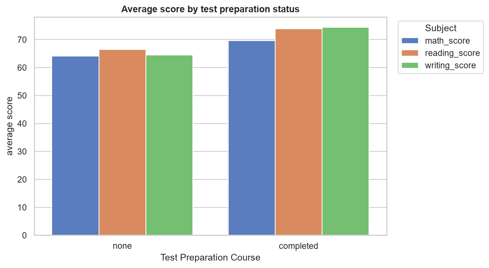
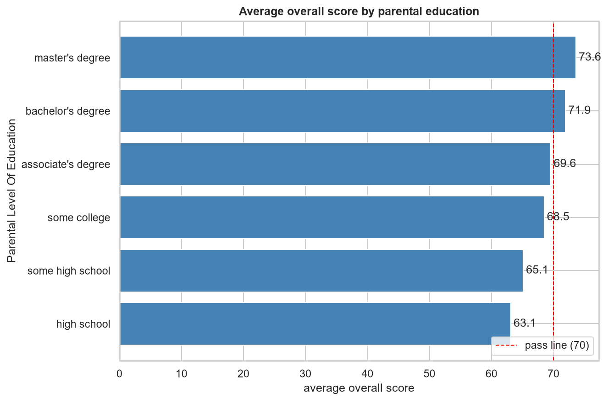
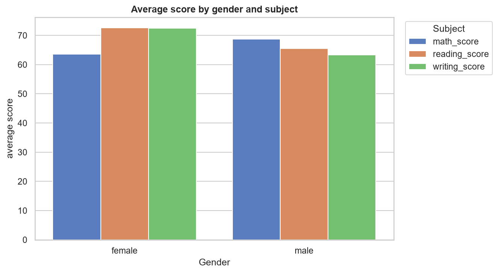

# GenAI with SQL — Text-to-SQL & Data Analytics

A data analytics pipeline that loads CSV datasets into MySQL, runs advanced
SQL report queries, and answers plain-English questions with a local LLM
(Ollama) that writes validated SQL.

**Shows:** MySQL 8.0 window functions (RANK, NTILE, LAG), CTEs, CASE WHEN,
ETL & schema inference, Python + pandas, data visualization, prompt
engineering, safe LLM-integrated SQL generation.

## Tech Stack

`Python 3.11 · MySQL 8.0 · pandas · matplotlib / seaborn · Ollama (local LLM)`

## How It Works

```text
CSV dataset
    │  python main.py inspect  → infers schema (types, PK, indexes)
    ▼
MySQL tables (InnoDB, indexed)
    │
    ├─▶ python main.py reports    → 11 advanced SQL report queries
    ├─▶ python main.py visualize  → 6 charts saved to charts/
    └─▶ python interactive_console.py → ask in English, LLM returns a
                                        safe SELECT, results printed
```

## Quick Start

```powershell
# setup (once)
python -m venv .venv
.\.venv\Scripts\Activate.ps1
pip install -r requirements.txt
Copy-Item .env.example .env     # add your MySQL password
ollama pull qwen2.5-coder:7b    # local LLM for text-to-SQL

# database
python main.py create-db        # creates the database
python main.py load             # creates tables and loads the CSV

# analysis
python main.py analytics        # counts, previews, summary stats
python main.py reports          # 11 advanced business reports
python main.py reports --name top-per-group   # run one report
python main.py visualize        # 6 charts → charts/ folder

# text-to-SQL
python interactive_console.py   # chat loop; ask questions, get SQL + results
```

## Advanced SQL Reports

All queries are generated from the live MySQL schema and pass a read-only
SELECT validator.

| Report | Technique demonstrated |
|---|---|
| Score summary with medians | CTE median (`ROW_NUMBER` + `COUNT() OVER ()`), `STDDEV` |
| A–F grade bands | CTE + `CASE WHEN` banding + `SUM() OVER ()` |
| Top 3 per group | `RANK() OVER (PARTITION BY ...)` |
| Quartile performance bands | `NTILE(4) OVER (PARTITION BY ...)` |
| Gap vs best group | `MAX() OVER ()` + `LAG()` |
| Test-prep effect | `GROUP BY` + per-subject `AVG` |
| Gender gap | `CASE WHEN` inside aggregates |
| Pass/fail rate per subject | Conditional `SUM`/`COUNT` |
| Largest score spread | `GREATEST()` / `LEAST()` |
| Trailing 5-row average | Sliding frame `ROWS BETWEEN 4 PRECEDING AND CURRENT ROW` |
| Parental education effect | Grouped summaries sorted by outcome |

## Visualizations

`python main.py visualize` generates 6 charts into `charts/`:

<table>
  <tr>
    <td align="center"></td>
    <td align="center"></td>
  </tr>
  <tr>
    <td align="center"></td>
    <td align="center"></td>
  </tr>
  <tr>
    <td align="center"></td>
    <td align="center"></td>
  </tr>
</table>

## Sample Results (student_performance, 1,000 rows)

- Students who **completed test prep** averaged **72.7** vs **65.0** for
  those who did not (+7.7 overall score).
- **Standard lunch** students outperform free/reduced in every quartile
  (e.g., Q4: 262 vs 241 avg total).
- Female students average **3.7 points higher** overall than males.
- 28.5% of students fall in the **F band**; pass rate ranges from 40.9%
  (math) to 51.3% (reading).

## Project Structure

```text
data/                  # CSV datasets
charts/                # generated visualizations (PNG)
src/
  data_loader.py       # schema inference + MySQL loading
  schema_utils.py      # name cleaning & type inference
  sql_reports.py       # 11 advanced SQL report queries
  visualization.py     # 6 business charts (matplotlib/seaborn)
  text_to_sql.py       # Ollama text-to-SQL + safe validation
  analytics.py         # general stats queries
  query_executor.py    # safe SELECT execution
main.py                # CLI entry point
interactive_console.py # text-to-SQL chat loop
```

## Notes

- The schema is inferred from any CSV, so the pipeline works with new
  datasets without code changes (score-based reports need `<subject>_score`
  columns).
- Requires **MySQL 8.0+** for window functions.